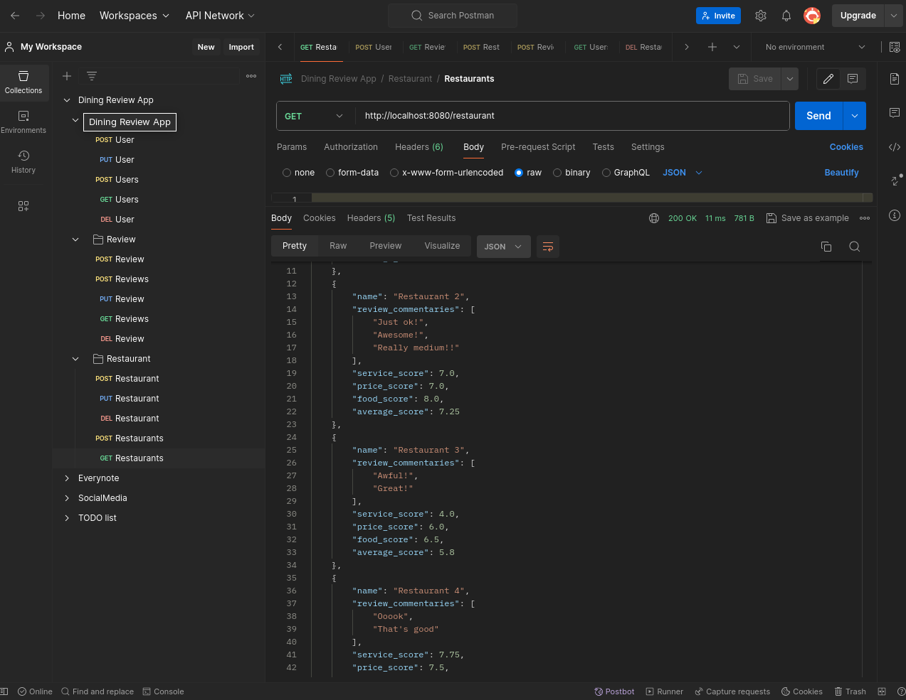

# JAVA-Summary

Awesome cheat sheet of JAVA **ANDDDD** AWESOME PROJECT

## DINING REVIEW PROJECT

Backend to a App where a users can make reviews to restaurant in different areas, each restaurant has the average of reviews (contains relationships, contains databases, full CRUD servise and etc, read more 👇👇👇).

- **HAS RELATIONSHIPS (One to Many and Many to One)**
- **H2 DATABASE and use of HIBERNATE**
- **Lombok to save us from write infinite code** 🙏🙏
- **USES OF DTOs!!!**

Checkout this Postman screenshot:

