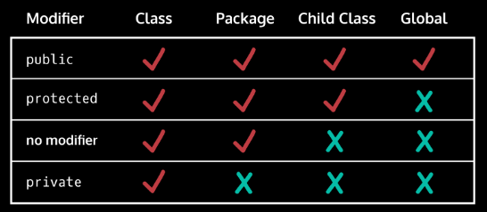

# Class

Class Student has **ATRIBUTES** and **METHODS** (functions)

# Object

It is an instance of the class.

# Constructors

How create the object:

```java
public class Dog {
  String breed; // instance field
  public Dog(String dogBreed) {
    breed = dogBreed;
  }
}
```

**INSTANCES NEED TO BE DECLARED _BEFORE_**

# Methods

- **Defining a method**: Method declarations will declare a method’s return type, name, and parameters
- **Calling a method**: Methods are invoked with a . and ()
- **Parameters**: Inputs to the method and their types are declared in parentheses in the method signature
- **Changing Instance Fields**: Methods can be used to change the value of an instance field
- **Scope**: Variables only exist within the domain that they are created in
- **Return**: The type of the variables that will be output are declared in the method declaration


