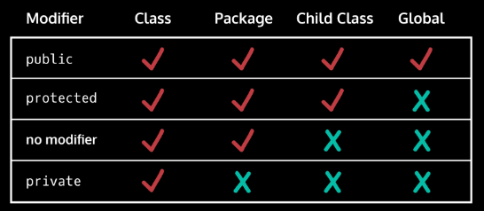

# ACCESS, ENCAPSULATION, AND SCOPE

## Access

### The public and private keywords

**Public** this means that any part of our code can interact with them - even if that code is in a different class!

**Private** means that you can only access those structures from elsewhere inside that same class.

### Encapsulation

Making our logic private, we encapsulate our code into nice little bundles of logic.

    For example, a Bank object doesn’t necessarily need to know the inner workings of a CheckingAccount object. It doesn’t need to know that the money is stored in a field named money

Accessor methods, sometimes known as “getters”
Mutator methods, sometimes known as “setters”
Scope
Local variables vs. instance variables
The this keyword

## Accessor and Mutator Methods

When writing classes, we often make **all** of our instance variables **private**. We might want other classes to have access to them, we just don’t want those classes to know the **exact variable name**. -> **accessor method** (sometimes also known as a **“getter” method**).

```java
public class Dog{
  private String name;
  //Other methods and constructors
  public String getName() {
    return name;
  }
}
```

**\private** instance variables often have **mutator methods** (sometimes known as **“setters”**).

```java
public class Dog{
  private String name;
  //Other methods and constructors
  public void setName(String newName) {
    name = newName;
  }
}
```

## Scope: The this Keyword

**"this"** keyword is a reference to the current object.

Programmers may create **local variables** with the same name as **instance variables**.

```java
public class Dog{
  public String name;

  public Dog(String inputName){
    name = inputName;
  }

  public void speakNewName(String name){
    System.out.println("Hello, my new name is" + name);
  }

  public static void main(String[] args){
    Dog myDog = new Dog("Winston");
    myDog.speakNewName("Darla"); // Prints "Darla" - "Winston" ignored
  }
}
```

Using **THIS Keyword**:

```java
public class Dog{
  public String name;

  public Dog(String inputName){
    name = inputName;
  }

  public void speakNewName(String name){
    System.out.println("Hello, my new name is" + this.name);
  }

  public static void main(String[] args){
    Dog myDog = new Dog("Winston");
    myDog.speakNewName("Darla"); // Prints "Winston" - "Darla" ignored
  }
}
```

## Review

- The **public** and **private** keywords are used to define what parts of code have access to other classes, methods, constructors, and instance variables.
- Encapsulation is a technique used to keep implementation details hidden from other classes. Its aim is to create small bundles of logic.
- The **this** keyword can be used to designate the difference between instance variables and local variables.
- Local variables can only be used within the scope that they were defined in.
- The **this** keyword can be used to call methods when writing classes.


